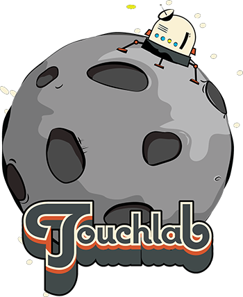

# Compose Animations

Group of libraries to help you build better animations with [Compose Multiplatform][compose]

## About

### Goal

The main goal of this project is to help you build animations with Compose Multiplatform. The Compose
animations API provides a rich animation API to handle state changes, but some cases require to implement
some boilerplate code.

### What's Included?

1. [Easings](./easing/) - A library with 30 different easings to control the speed of your animations
2. [Value Animator](./value-animator/) - API that provides you the same functionality from Android ValueAnimator, but using only compose methods

### Why?

Compose animations are mainly focused on state changes. If you want to animate a value from X to Y, you need to:

1. Create a state to control the state (and move from current to target)
2. Use the `animate` function (which requires a coroutine scope and posting the value to some state);

Another limitation is when you have multiple values to animate through. In this case, there is no built-in solution
to handle this case. Most APIs have similar syntax to Compose methods to make it more intuitive for you.

### API

#### `animate*AsState`

> Animate a value from X to Y and return the value as a state

- `animateFloatAsState`
- `animateIntAsState`
- `animateDpAsState`
- `animateSizeAsState`
- `animateOffsetAsState`
- `animateRectAsState`
- `animateIntOffsetAsState`
- `animateIntSizeAsState`
- `animateColorAsState`

Signature:
```kotlin
@Composable
fun animateFloatAsState(
    initialValue: Float,
    targetValue: Float,
    startDelay: Long = 0,
    animationSpec: AnimationSpec<Float> = spring(),
): State<Float>
```

If you are using `InfiniteTransition`, compose already provide built-in methods for this.

#### `animate*ValuesAsState`

> Animate through all values provided as arguments

- `animateFloatValuesAsState`
- `animateIntValuesAsState`
- `animateDpValuesAsState`
- `animateSizeValuesAsState`
- `animateOffsetValuesAsState`
- `animateRectValuesAsState`
- `animateIntOffsetValuesAsState`
- `animateIntSizeValuesAsState`
- `animateColorValuesAsState`

Signature:

```kotlin
@Composable
fun animateFloatValuesAsState(
    vararg values: Float,
    startDelay: Long = 0,
    animationSpec: AnimationSpec<Float> = spring(),
): State<Float>
```

These methods are also available for `InfiniteTransition`. Signature:

```kotlin
@Composable
fun InfiniteTransition.animateFloatValues(
    vararg values: Float,
    animationSpec: InfiniteRepeatableSpec<Float> = infiniteRepeatable(animation = tween()),
    label: String = "MultipleFloatAnimation",
): State<Float>
```

#### ValueAtFraction

> Interface to implement animation progress for unsupported types.
> It can be used on `animateAsState` and `animateValuesAsState` methods.

Signature:
```kotlin
fun interface ValueAtFraction<T> {
    operator fun invoke(
        fraction: Float,
        initialValue: T,
        finalValue: T,
    ): T
}
```

Example:

```kotlin
val floatAtFraction = ValueAtFraction<Float> { fraction, initialValue, finalValue ->
    initialValue + (finalValue - initialValue) * fraction
}

@Composable
fun AnimationTest() {
    val state by animateValuesAsState(
        values = floatArrayOf(0f, 1f, -1f, 4f),
        getValueAtFraction = floatAtFraction,
        startDelay = startDelay,
        animationSpec = animationSpec,
    )
}
```

The lib already provide a few implementations for types previously mentioned:

```kotlin
val ValueAtFraction.Companion.Float: ValueAtFraction<Float>
val ValueAtFraction.Companion.Int: ValueAtFraction<Int>
val ValueAtFraction.Companion.Dp: ValueAtFraction<Dp>
val ValueAtFraction.Companion.Size: ValueAtFraction<Size>
val ValueAtFraction.Companion.Offset: ValueAtFraction<Offset>
val ValueAtFraction.Companion.Rect: ValueAtFraction<Rect>
val ValueAtFraction.Companion.IntOffset: ValueAtFraction<IntOffset>
val ValueAtFraction.Companion.IntSize: ValueAtFraction<IntSize>
val ValueAtFraction.Companion.Color: ValueAtFraction<Color>
```

If you create custom types, you can also provide them as extensions from the ValueAtFraction companion.

#### Easings

The `easing` module contains 30 different easings to control the speed of your animations. For more information, check 
the [easing website](https://easings.net/), we've implemented all the easings available there.

Example:

```kotlin
@Composable
fun MyAnimatedComponent() {
    val value by animateFloatAsState(
        initialValue = 0f,
        targetValue = 1f,
        animationSpec = infiniteRepeatable(
            animation = tween(
                durationMillis = 1500,
                easing = EaseInCirc, // Change the easing here
            ),
        )
    )
    
    // Use your animated value
}
```

## About Touchlab

Touchlab is a mobile-focused development agency based in NYC. We have been working on Android since
the beginning, and have worked on a wide range of mobile and hardware projects for the past decade.
Over the past few years, we have invested significantly on R&D for code sharing technologies.
We believe strongly in KMP's future and are making the Kotlin platform the focus of our business.

### What We Can Do For You

We have made KMP the focus of Touchlab. We had possibly the first KMP* app published in the iOS
App Store, and have extensive experience in building libraries and the Kotlin platform, including
contributions to Kotlin/Native itself. We can establish and accelerate your adoption of shared
Kotlin code. See [touchlab.co](https://touchlab.co) for more info.

[](https://touchlab.co)


License
=======

    Copyright 2024 Touchlab, Inc.
    
    Licensed under the Apache License, Version 2.0 (the "License");
    you may not use this file except in compliance with the License.
    You may obtain a copy of the License at
    
       http://www.apache.org/licenses/LICENSE-2.0
    
    Unless required by applicable law or agreed to in writing, software
    distributed under the License is distributed on an "AS IS" BASIS,
    WITHOUT WARRANTIES OR CONDITIONS OF ANY KIND, either express or implied.
    See the License for the specific language governing permissions and
    limitations under the License.

[compose]: https://www.jetbrains.com/lp/compose-multiplatform/
